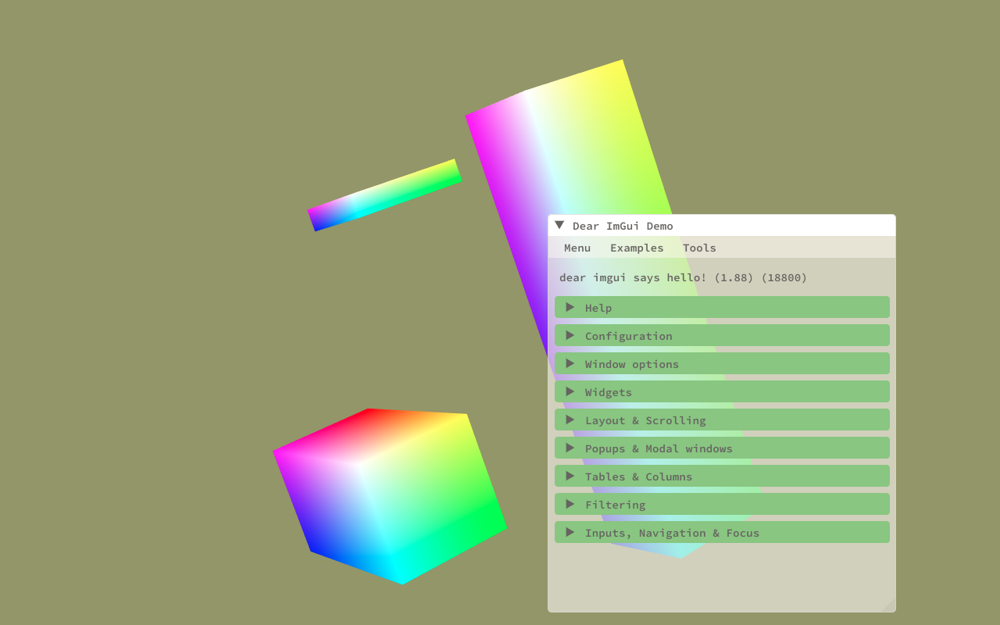

# BIGGEngine

## C++ / Lua Game Engine made with the BIGG stack.

### About

This is a game engine built on the BIGG Stack (BGFX, Dear ImGui, glm, GLFW)
which uses C++ for the main systems and Lua for scripting. The current features
are:
- Window / IO context system
- Event System
- Modular Rendering system (WIP)
    - GUI using Dear ImGui
- Entity component system using entt
- Scripting using Lua (WIP)
- Development tools:
    - Logging
    - Profiling
    
### Screenshot

    
    
### Building dependencies

glfw, imgui, spdlog:
- look at individual instructions. build a static lib.

glm, entt
- header only

lua
- download from lua.org

### Building bgfx, bx, bimg
Use genie, bgfx's build tool, to build the libs. Optionally, build the tools. Maybe even build the examples. Genie is located inside bx/tools/bin/darwin/genie.

- `export GENIE=../bx/tools/bin/darwin/genie`

- `$GENIE --with-shared-lib --with-tools --gcc=osx-x64 gmake`
    - other options: `--with-combined-examples`
- `make -C .build/projects/gmake-osx-x64 config=debug`
    - this will build everything afaik
    - `-C` sets the working directory of the make instruction
    - can also do `config=release` or `verbose=1`
    - specify which targets to build ie `bx`, `bgfx`, `bimg`, `shaderc`, `texturec`, `texturev`, `geometryc`, `geometryv`
    - run `make help` inside `.build/projects/gmake-osx-x64`

### Building bgfx tools (shaderc, geometryc, texturec)
See the [bgfx API](https://bkaradzic.github.io/bgfx/tools.html) for more information on how to use tools.

Basically, after running `$GENIE --with-shared-lib --with-tools --gcc=osx-x64 gmake`, I should have a folder `./build/projects/gmake-osx-x64`. Go into here and type `make help`. Follow the instructions to build each tool. Most importantly, set `config=debug`.

For example:
- shaderc: `make config=debug shaderc`
- geometryc: `make config=debug geometryc`

### How to build a `.sc` shader
- Dependencies
    - shaderc
        - fccp
        - glslang
        - glsl-optimizer
        - spirv-opt
        - sprirv-cross
        - bx
    
- must have these files in the directory and included in the script
    - `bgfx_shader.sh`, `shaderlib.sh`, `varying.def.sc`
    - The first two are (should be) included in the `.sc`. The last file IDK what it is

TL;DR use shaderc. try `shaderc --help`

### CMAKE things

clean Cmake files: `cmake --build build/ --target clean`

# NOTES

See bgfx/tools/geometryv fragment shader for a spherical harmonics shader impl
